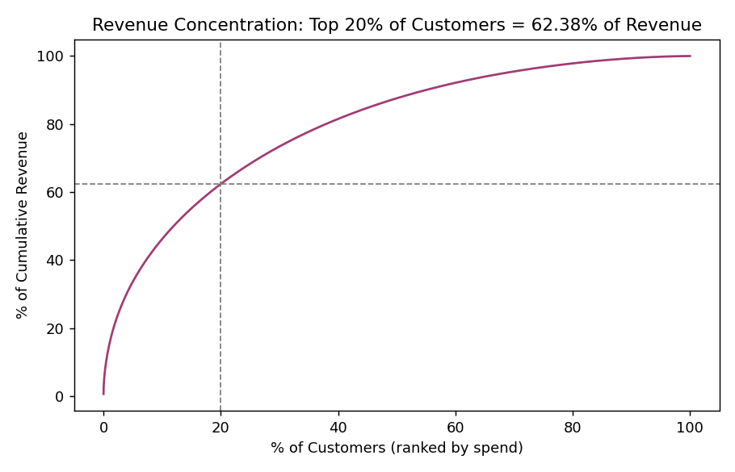
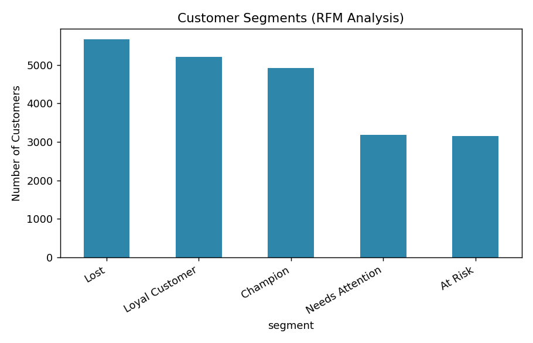

# E-Commerce Sales & Customer Analysis

End-to-end analysis of an e-commerce dataset (100,000+ orders, 5 linked tables)
using SQL, Python, and Power BI — covering revenue trends, customer lifetime
value, RFM segmentation, and regional/category performance.

## Dataset
Synthetic dataset generated to mirror the structure and scale of real
e-commerce data (customers, orders, order_items, payments, products, reviews).
Revenue is intentionally skewed (Pareto distribution) to reflect realistic
customer spend concentration rather than a uniform, unrealistic spread.
Generation script: [`python/generate_data.py`](python/generate_data.py).

| Table | Rows |
|---|---|
| customers | 35,000 |
| orders | 102,000 |
| order_items | 156,883 |
| payments | 87,404 |
| reviews | 24,691 |
| products | 1,200 |

## Tech stack
- **MySQL** — schema design, 16 analytical queries (multi-table JOINs, CTEs, window functions, subqueries)
- **Python (pandas, matplotlib)** — RFM segmentation, cohort analysis, data generation
- **Power BI** — KPI dashboard sliced by region, category, and time period

## Key findings
- **Top 20% of customers generated 62.4% of total revenue** (RFM/Pareto analysis) — validated independently in both SQL ([`sql/queries.sql`](sql/queries.sql), Q4) and Python ([`python/rfm_analysis.py`](python/rfm_analysis.py))
- Southeast region drives ~45% of total revenue; return rates are consistent (~16-17%) across all regions, ruling out a regional quality issue
- Customer base splits into 5 RFM segments — Champions (22.2%), Loyal (23.6%), Needs Attention (14.4%), At Risk (14.2%), Lost (25.6%) — used to prioritize retention outreach
- Revenue grew month-over-month across the analysis window, with the Southeast and South regions as primary growth drivers




## Repository structure
```
├── sql/
│   ├── schema.sql          # MySQL schema (5 tables, FKs, indexes)
│   └── queries.sql         # 16 documented analytical queries
├── python/
│   ├── generate_data.py    # Synthetic dataset generator
│   ├── load_db.py          # Loads CSVs into a queryable database
│   └── rfm_analysis.py     # RFM segmentation + charts (pandas)
├── powerbi/
│   ├── fact_orders.csv, fact_order_items.csv, dim_customers.csv, dim_products.csv
│   ├── measures.dax        # DAX measures for the dashboard
│   └── README.md           # Step-by-step Power BI build guide
├── data/                   # Raw generated CSVs + SQLite build
└── docs/                   # Chart images used in this README
```

## How to reproduce
```bash
pip install pandas numpy faker matplotlib
python python/generate_data.py     # generates data/*.csv
python python/load_db.py           # builds data/ecommerce.db
python python/rfm_analysis.py      # runs RFM analysis, saves charts to docs/
```
The queries in `sql/queries.sql` are written in MySQL syntax and can be run
directly against MySQL Workbench after loading `sql/schema.sql` and importing
the CSVs (`LOAD DATA INFILE`, commented at the bottom of `schema.sql`). They
were validated against a SQLite build of the same schema during development
(same CTEs/window functions/JOINs — SQLite 3.25+ and MySQL 8.0 share this
syntax) — see `python/load_db.py`.

## Note on the underlying data
This project uses a synthetically generated dataset built to match the scale,
schema, and statistical properties (e.g., realistic Pareto-distributed
customer spend) of real e-commerce transaction data. It is not sourced from a
live business. This is disclosed here for transparency — the SQL, the
segmentation methodology, and the Power BI model are the actual skills being
demonstrated.
